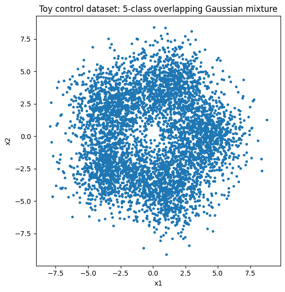

# Control Dataset for "Learning Optimal Conformal Classifiers"

The generation code and the dataset are available on Github [here](https://github.com/feenix-ho/control-dataset).

## Why this control dataset is a precise test of the paper's claim

Paper's focal claim

> Conformal Training (ConfTr) learns to shrink the average size of the prediction set ("inefficiency")—while keeping the formal coverage guarantee—compared with a vanilla cross-entropy network that is wrapped with Conformal Prediction only after training.

Property we must isolate

> Does training through the conformal wrapper actually help in regions of genuine class overlap, or is any observed gain just a side-effect of lucky class priors or easy points?

## How the toy dataset targets that property

| Experimental need                                                                | Design choice                                                                  | Rationale                                                                                                                                                                                      |
| -------------------------------------------------------------------------------- | ------------------------------------------------------------------------------ | ---------------------------------------------------------------------------------------------------------------------------------------------------------------------------------------------- |
| **Non-trivial ambiguity zone** where a point can plausibly belong to 2-3 classes | Five 2-D Gaussians whose tails overlap in a large "doughnut" around the origin | Forces the conformal set to contain multiple labels whenever a point lands in the shared density region—exactly where inefficiency matters                                                     |
| **Clear low-ambiguity zones** near each mean                                     | Well-separated centers on a regular pentagon, radius = 4                       | Allows us to verify that both ConfTr and the baseline collapse to single-label sets when the class is obvious; any inefficiency reduction must therefore come from handling the overlap better |
| **Uniform class priors**                                                         | Equal number of samples per class                                              | Removes "lucky class-imbalance" as an explanation for smaller sets                                                                                                                             |
| **Full control & reproducibility**                                               | Purely synthetic generator with fixed seed                                     | Lets us repeat the test under different overlaps (tune _σ_) or number of classes without changing any other factor                                                                             |

Because we **know** which regions are ambiguous and which are not, we can cleanly attribute any drop in average set size to how each method treats the ambiguous ring—exactly the mechanism the paper claims to improve.

## Description of the control dataset

-   Dimensionality: 2-D (easy to visualize).
-   Classes: $K = 5$.
-   Class centers: vertices of a regular pentagon, radius $R = 4$ around the origin.
-   Sampling distribution: For each class k, draw
    $$
    x \sim \mathcal{N}(\mu_k, \sigma ^2 I_2) \quad \mu_k = (R \cos (2 \pi k/ K)) \quad \sigma = 1.5
    $$
-   Size: $N = 5 000$ (1 000 points per class).
-   Ambiguity pattern:
    -   Near each center (≈ 1 σ) the Bayes-optimal set is the single true label.
    -   In the "doughnut" where class tails overlap (≈ 2-3 σ) the Bayes-optimal set contains 2-3 labels. - Far outside (≈ > 4 σ) every label is plausible; a good conformal set will usually return the full class list.

The image above is a scatter plot of the sample dataset. The dense mid-ring is where we expect any inefficiency to arise.

## How the dataset was generated

-   Fix parameters: `K = 5`, `DIM = 2`, `RADIUS = 4`, `SIGMA = 1.5`, `N = 5 000`, `random_seed = 42`.
-   Compute means: the five vertices of a pentagon `RADIUS * cos(2 * pi * k / K), RADIUS * sin(2 * pi * k / K)`
-   Draw samples: for each class, sample `N/K` points from a spherical Gaussian with that mean and covariance `(SIGMA ** 2) * np.eye(DIM)`.
-   Label: assign the generating class index (0-4).
-   Save: write to CSV with columns x1, x2, label.
